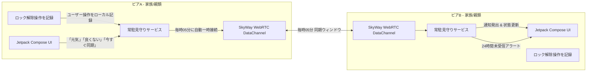

# BugsLife (遠隔見守り) - P2P相互安否見守りアプリ

[-green.svg)](https://developer.android.com)
[](https://kotlinlang.org)
[](https://skyway.ntt.com)
[](https://developer.android.com/jetpack/compose)
[](LICENSE)

[**English Document**](./README.md)

**BugsLife（遠隔見守り）** は、遠方に住む家族・親類や知人同士が専用の監視サーバーを介さず、端末同士で直接安否を確認し合える分散型P2P相互見守りAndroidアプリケーションです。

**NTT Communications SkyWay（WebRTC DataChannel）** によるNAT越え・4G/5G回線経由でのインターネットP2P通信に対応しており、共通のグループ名（Room名）を設定するだけで自動的に接続されます。

全端末がお互いを気遣い合う **「相互見守りモデル」** と、親世代の低容量SIMプラン（0.5GB〜3GB）やバッテリー消費に最大限配慮した **「毎時05分 定期同期モデル（月間約7〜8MB）」** を採用しています。

---

## 💡 設計思想・ポリシー

### 🤝 対等な関係性での「相互見守り」
- **「見守る／見守られる」の上下関係をなくす**: 従来の監視型見守りアプリのような「見守る側」と「見守られる側」という一方的・非対称な関係ではなく、**参加者全員が対等な立場で互いの安全や無事を気に掛け合える関係性** を前提として設計されています。
- **心理的負担・プライバシー侵害感の解消**: 一方的に監視されているような窮屈さやプレッシャーを感じさせることなく、日常の自然なスマホ利用（ロック解除・操作など）を通じてさりげなくお互いの無事を確認し合えます。
- **過剰なリアルタイム監視を避けた「緩やかな見守り」**: 「良くない」ボタンは緊急通報（救急車）の代替ではなく、「体調がすぐれない」「病院に行きたい」といった緩やかな近況共有を目的としています。そのため毎時05分の定期同期で十分な安心感を提供します。

---

## 🔒 セキュリティ & プライバシー & 安全性

1. **完全P2P設計（サーバーにデータを保有しない）**:
   - 中央サーバーにメッセージや利用履歴などのプライベートデータを一切蓄積・保有しないP2P（Peer-to-Peer）通信方式を採用。
   - 万が一外部への情報漏洩リスクが生じた場合でも、サーバー上に個人の安否履歴データ自体が存在しません。
2. **通信内容は「本人の状態」のみに限定**:
   - 送信されるデータは「操作回数」や「元気／良くない」といった本人の状態ステータス情報のみ。
   - 位置情報（GPS）、カメラ映像、音声、端末内の個人情報や操作ログなどは一切取得・送信しません。
3. **着信・通知による画面点灯の誤検知を排除 (`ACTION_USER_PRESENT`)**:
   - 電話の着信やメール・アプリ通知の受信で画面がついただけでは活動とみなさず、**「本人が画面ロックを解除した／操作した」時のみを確実に検知**します。
   - 不在着信やスパムメール等で誤って「生存シグナル」が更新されてしまうリスクを防ぎます。
4. **毎時05分 定期同期による圧倒的な省パケット（月間 約7〜8MB）**:
   - 操作時はローカルに時刻・回数を記録するだけで通信を行わず、毎時05分の同期ウィンドウ時のみ短時間（約90秒）SkyWayへ接続して相互交換・即切断します。
   - 親世代に多い小容量プラン（0.5GB〜3GB）でも、月間わずか1%台の消費で安心して運用できます。

---

## 🌟 主な機能

1. **毎時05分の定期P2P同期 (SkyWay WebRTC DataChannel)**:
   - 全端末が毎時05分（10:05, 11:05...）にSkyWay Roomへ自動接続し、直近の状態パケットを相互交換後、即座に切断・スリープへ復帰。
   - 共通のグループ名（Room名）を設定するだけで、面倒なIPアドレス設定不要で自動相互接続。

2. **スマホ操作（ロック解除）のローカル自動記録**:
   - ユーザーが端末をロック解除・操作した際（`ACTION_USER_PRESENT`）にローカルで検知・カウント。
   - 毎時05分の定期同期時に「本日スマホ操作: X回」として相手へ送信。

3. **24時間無操作・未受信アラート (Watchdog)**:
   - 登録された各相手の直近の操作時刻をバックグラウンドで監視。
   - 相手からの信号が **24時間**（テスト用に1分〜24時間で設定変更可能）途絶えた場合、高優先度の安否警告アラート（音・振動・ヘッドアップ通知）を自動発出。

4. **ワンタップ「元気」「良くない」クイックボタン & 今すぐ同期**:
   - シニア世代でも押しやすい大型タッチカードボタン：
     - **😄 元気です**: 相手全員へ元気である旨を即座に通知。
     - **😣 良くない**: 体調不良や異常を相手全員へ通知。
   - UI上の **「今すぐ同期」** ボタンで、毎時05分を待たずにいつでも手動同期可能。

5. **相互見守り統合UI**:
   - 役割選択や複雑な切り替え不要の1画面レイアウト。
   - 次回同期予定時刻（例: 10:05）と最終同期時刻、現在の同期状態（スリープ待機 / 🔄同期中）を表示。
   - 相手端末ごとのリアルタイム経過時間（「15分前」「23時間前」等）および状態バッジ（🟢 正常 / ⚠️ 24時間無反応 / 😄 元気 / 😣 良くない）を表示。
   - リアルタイム通信ログ確認シートを搭載。

6. **幅広い端末対応**:
   - **Android 6.0 (API 23, Marshmallow) 〜 Android 15+** まで幅広く対応。
   - 常駐フォアグラウンドサービスにより、Dozeモード等のOS省電力制限下でも安定稼働。

---

## 🌐 SkyWayについて & APIキーの取得方法

本アプリのインターネット越しのP2P通信には、NTT Communicationsが提供するWebRTCプラットフォーム **SkyWay** を使用しています。

### SkyWayとは？
- 端末間の直接暗号化通信（WebRTC）を仲介・中継するサービスです。
- 監視サーバーに個人データや安否メッセージを保存することなく、4G/5Gや家庭内Wi-FiのNAT/ファイアウォールを安全に通過して直接端末間で通信できます。
- **個人・開発者向けに無料枠（Freeプラン）** が提供されています。

### SkyWay APIキー（App ID & Secret Key）の取得手順

1. [SkyWay 公式ポータル (コンソール)](https://console.skyway.ntt.com/) にアクセスし、無料アカウント登録またはログインします。
2. ダッシュボードのメニューから **「アプリケーション」** を選択し、**「新規作成」** ボタンをクリックします。
3. アプリケーション名（例: `BugsLife`）を入力して作成します。
4. 作成されたアプリケーションの詳細画面から、以下の2つの文字列をコピーします：
   - **アプリケーションID (App ID)**: `xxxxxxxx-xxxx-xxxx-xxxx-xxxxxxxxxxxx` (UUID形式)
   - **シークレットキー (Secret Key)**: `xxxxxxxxxxxxxxxxxxxxxxxxxxxxxxxxxxxxxxxxxxx=` (Base64形式)
5. 見守りを行うすべての端末で、本アプリ起動後に右上の **設定 (⚙️)** を開き、上記で取得した **App ID** と **Secret Key** を入力して保存します。

> [!TIP]
> 見守り合うご家族同士で **同じ App ID、Secret Key、および見守りグループ名（Room名）** を設定することで、自動的にP2P接続が確立されます。

---

## 🛠 システム構成 & 使用技術

- **UI**: Jetpack Compose (Material 3)
- **言語**: Kotlin + Coroutines / StateFlow
- **常駐監視**: Android Foreground Service (`WatcherForegroundService`)
- **P2P通信**:
  - **SkyWay WebRTC**: `SkyWayPeerMessenger` (P2PRoom & DataStream)



---

## 🚀 使い方・動作確認手順

### 必要な環境
- Android 6.0（API 23）以上のAndroidスマートフォン 2台以上
- インターネット接続（Wi-Fi または 4G/5Gモバイル回線）
- SkyWay アカウント（無料）の App ID および Secret Key

### セットアップ手順
1. 本アプリを2台のスマートフォン（端末A、端末B）にインストールして起動します。
2. アプリ右上の **設定 (⚙️)** を開きます。
   - **「SkyWay 見守り接続」** がONになっていることを確認します。
   - **「SkyWay アプリケーションID」** と **「SkyWay シークレットキー」** を入力します。
   - **「見守りグループ名 (Room名)」** に2台共通の任意の合言葉（例: `tanaka-family-room`）を入力して保存します。
3. 端末Aで **「今すぐ同期」** または **「😄 元気です」** をタップすると、端末B側と即時同期され、お互いが一覧に登録されます。
4. 普段はスマホを普通に使う（ロック解除する）だけで操作が記録され、**毎時05分** に自動で相手へ近況が届きます。
5. 設定（⚙️）から無反応検知タイムアウトを **「1分」** に設定し、1分間画面を操作せずに放置すると、**「⚠️ 安否警告」通知** が鳴動することを確認できます。

---

## 🗺 開発状況

- [x] **常駐見守りコアシステム**
  - スマホ操作検知（ロック解除 `ACTION_USER_PRESENT` / 着信誤検知防止）
  - 毎時05分定期同期スケジューラ（省パケット・省電力）
  - 24時間無操作・未受信Watchdogアラート（通知・音・バイブレーション）
  - 大型クイックステータス通知ボタン（「元気です」「良くない」）
  - Android 6.0 (API 23) 〜 Android 15+ 完全互換
- [x] **インターネットP2P通信 (SkyWay WebRTC)**
  - SkyWay SDK v2.9.0 (P2PRoom & DataStream) 統合
  - JWT Auth Token 自動署名・生成機構
  - 4G/5G回線 & 異ネットワーク間でのP2P NAT越え（STUN/TURN）
  - Room名による自動ピアリング & メッセージ同期
  - リアルタイム通信ログ確認機能

---

## 📄 ライセンス

```text
Copyright 2026 amekusa03

Licensed under the Apache License, Version 2.0 (the "License");
you may not use this file except in compliance with the License.
You may obtain a copy of the License at

    http://www.apache.org/licenses/LICENSE-2.0
```
