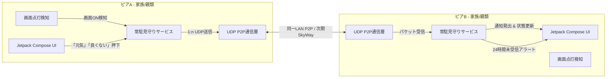

# BugsLife (遠隔見守り) - P2P相互安否見守りアプリ

[-green.svg)](https://developer.android.com)
[](https://kotlinlang.org)
[](https://developer.android.com/jetpack/compose)
[](LICENSE)

[**English Document**](./README.md)

**BugsLife（遠隔見守り）** は、遠方に住む家族・親類や知人同士がサーバーを介さずに直接端末同士で安否を確認し合える、分散型P2P相互見守りAndroidアプリケーションです。

「見守られる側」「見守る側」の区別なく、**全端末がお互いを常時見守り合う「相互見守りモデル」** を採用しています。

---

## 🌟 主な機能

1. **画面点灯（Screen ON）時の自動ハートビート送信 (P2P 1:n)**:
   - スマートフォンの画面を点灯またはロック解除した際（`ACTION_SCREEN_ON` / `ACTION_USER_PRESENT`）に、登録されたすべての相手端末へ生存確認パケットを自動同報送信。
   - 15秒間のデバウンス制御により、バッテリーや通信パケットの過剰消費を防止。

2. **24時間無操作・未受信アラート (Watchdog)**:
   - 登録された各相手の直近の操作時刻をバックグラウンドで監視。
   - 画面点灯が **24時間**（テスト用に1分〜24時間で設定変更可能）途絶えた場合、高優先度の安否警告アラート（音・振動・ヘッドアップ通知）を自動発出。

3. **ワンタップ「元気」「良くない」クイックボタン**:
   - シニア世代でも押しやすい大型タッチカードボタン：
     - **😄 元気です**: 相手全員へ元気である旨を即座に通知。
     - **😣 良くない**: 体調不良や異常を相手全員へ緊急高優先度通知。

4. **分散型 1:n P2P通信**:
   - 同一LAN（Wi-Fi）内の端末同士で直接UDP通信。
   - インターフェース設計（`PeerMessenger`）により、インターネット経由のWebRTC / SkyWay通信への切り替えが容易な拡張性を確保。

5. **相互見守り統合UI**:
   - 役割選択や複雑な切り替え不要の1画面レイアウト。
   - 相手に登録してもらうための「自分のIPアドレス」を最上部に常時明記。
   - 相手端末ごとのリアルタイム経過時間（「15分前」「23時間前」等）および状態バッジ（🟢 正常 / ⚠️ 24時間無反応 / 😄 元気 / 😣 良くない）を表示。
   - リアルタイム通信ログ確認シートを搭載。

6. **幅広い端末対応**:
   - **Android 6.0 (API 23, Marshmallow) 〜 Android 15+** まで幅広く対応。
   - 常駐フォアグラウンドサービスにより、Dozeモード等のOS省電力制限下でも安定稼働。

---

## 🛠 システム構成 & 使用技術

- **UI**: Jetpack Compose (Material 3)
- **言語**: Kotlin + Coroutines / StateFlow
- **常駐監視**: Android Foreground Service (`WatcherForegroundService`)
- **通信**: P2P UDP Socket（1:nユニキャスト & ブロードキャスト）
- **将来拡張**: NTT Communications SkyWay SDK（WebRTC DataChannelによるインターネット越しのP2P）



---

## 🚀 使い方・動作確認手順

### 必要な環境
- Android 6.0（API 23）以上のAndroidスマートフォン 2台以上
- 同一のWi-Fiネットワーク

### セットアップ手順
1. 本アプリを2台のスマートフォン（端末A、端末B）にインストールして起動します。
2. 画面上部に表示されている **「あなたのIPアドレス」** を確認します。
3. 端末Aで **「相手を追加」** をタップし、端末Bの名前とIPアドレスを入力して保存します。同様に端末Bでも端末AのIPアドレスを登録します。
4. 端末Aの画面を一度消灯し、再度点灯させると、端末B側の最終検知時刻が自動更新されます。
5. **「😄 元気です」** または **「😣 良くない」** ボタンをタップすると、相手端末へ即座に通知が表示されます。
6. 設定（⚙️）から無反応検知タイムアウトを **「1分」** に設定し、1分間画面を点灯させずに放置すると、**「⚠️ 安否警告」通知** が鳴動することを確認できます。

---

## 🗺 ロードマップ

- [x] **フェーズ1: 同一LAN内 P2P (UDP)**
  - 画面点灯ブロードキャスト検知 & 常駐フォアグラウンドサービス
  - 1:n UDPパケット同報送信
  - 24時間無操作・未受信Watchdogアラート
  - 大型ステータス通知ボタン
  - Android 6.0+ サポート
- [ ] **フェーズ2: インターネット対応 (WebRTC / SkyWay)**
  - NTT Communications SkyWay SDKを利用したインターネット越しのP2Pシグナリング
  - NAT/ファイアウォール越え（STUN/TURN）による完全P2P DataChannel通信
  - QRコード読み取りによるワンタッチペアリング機能

---

## 📄 ライセンス

```text
Copyright 2026 amekusa03

Licensed under the Apache License, Version 2.0 (the "License");
you may not use this file except in compliance with the License.
You may obtain a copy of the License at

    http://www.apache.org/licenses/LICENSE-2.0
```
