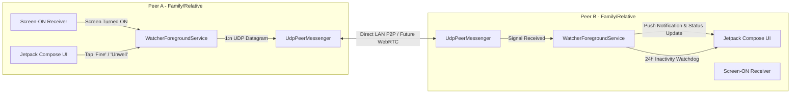

# BugsLife (遠隔見守り) - P2P Mutual Safety Watcher

[-green.svg)](https://developer.android.com)
[](https://kotlinlang.org)
[](https://developer.android.com/jetpack/compose)
[](LICENSE)

[**日本語ドキュメント (Japanese)**](./README.ja.md)

**BugsLife** is a decentralized, peer-to-peer (P2P) safety monitoring Android application designed to keep distant family members, relatives, and friends connected and safe without centralized surveillance servers or account registrations.

It operates on a **Mutual Watching Model** where all connected devices act as both sender and watcher.

---

## 🌟 Key Features

1. **Automatic Screen-ON Heartbeat (P2P 1:n)**:
   - When you turn ON or unlock your smartphone screen (`ACTION_SCREEN_ON` / `ACTION_USER_PRESENT`), an automatic heartbeat signal is sent to all registered peer devices.
   - Built-in debounce mechanism (15 seconds) prevents unnecessary battery and network drain.

2. **24-Hour Inactivity Watchdog Alert**:
   - Continuously tracks the last-seen active timestamp of all connected peers.
   - If no screen-ON or heartbeat signal is received for **24 hours** (configurable from 1 min to 24 hours for testing), a high-priority alarm notification (sound, vibration, heads-up) is triggered.

3. **One-Tap Quick Status Buttons**:
   - Senior-friendly, large tactile buttons:
     - **😄 Feeling Good (元気です)**: Informs everyone that you are doing great.
     - **😣 Not Well (良くない)**: Promptly alerts all connected peers with high priority.

4. **Decentralized 1:n P2P Communication**:
   - Direct UDP communication across devices on the local network (LAN / Wi-Fi).
   - Designed with an extensible `PeerMessenger` interface for seamless transition to WebRTC / SkyWay in Phase 2.

5. **Mutual Watching Interface**:
   - Single unified screen: No complex role selection needed.
   - Prominently displays your local IP address for easy exchange and pairing.
   - Real-time elapsed time counters (e.g. "15 minutes ago", "23 hours ago") for every peer.
   - Real-time communication logs inspection bottom sheet.

6. **Broad Device Compatibility**:
   - Supports **Android 6.0 (API 23, Marshmallow) up to Android 15+**.
   - Stable background operation via persistent Foreground Service.

---

## 🛠 Architecture & Tech Stack

- **UI**: Jetpack Compose (Material Design 3)
- **Language**: Kotlin + Kotlin Coroutines & Flows
- **Service**: Android Foreground Service (`WatcherForegroundService`)
- **Networking**: P2P UDP Socket Broadcast/Multicast/Unicast (`UdpPeerMessenger`) -> Extensible to WebRTC (SkyWay)
- **State Management**: `StateFlow` & `SharedFlow` with `WatcherStateHolder`



---

## 🚀 Getting Started

### Prerequisites
- Android Studio Ladybug or newer / JDK 17+
- Android Device or Emulator running Android 6.0+ (API 23+)
- Connected to the same Wi-Fi / Local Area Network (for LAN testing)

### Installation & Run

1. Clone this repository:
   ```bash
   git clone https://github.com/amekusa03/BugsLife.git
   cd BugsLife
   ```

2. Build and run debug APK:
   ```bash
   ./gradlew assembleDebug
   ```

3. Install on connected Android devices:
   ```bash
   adb install -r app/build/outputs/apk/debug/app-debug.apk
   ```

---

## 📖 How to Use

1. Launch **BugsLife** on two or more Android devices on the same Wi-Fi network.
2. Note your **IP Address** displayed at the top of the screen on each device.
3. Tap **"相手を追加 (Add Peer)"** on Device A, enter Device B's IP address and name. Do the same on Device B for Device A.
4. Turn off and turn on the screen on Device A: Device B will automatically update the last-seen status and time!
5. Tap **"😄 元気です"** or **"😣 良くない"** to test instant push notifications.

---

## 🗺 Roadmap

- [x] **Phase 1: Local Network P2P (LAN UDP)**
  - Screen-ON detection via BroadcastReceiver & Foreground Service
  - 1:n direct UDP packet broadcast & unicast
  - 24-hour inactivity watchdog & notification alert
  - Senior-friendly large status buttons
  - Android 6.0+ compatibility
- [ ] **Phase 2: Over-the-Internet P2P (WebRTC / SkyWay)**
  - Global peer signaling via NTT Communications SkyWay SDK
  - End-to-end encrypted peer-to-peer data channels across NATs/firewalls
  - QR code pairing for zero-configuration setup

---

## 📄 License

```text
Copyright 2026 amekusa03

Licensed under the Apache License, Version 2.0 (the "License");
you may not use this file except in compliance with the License.
You may obtain a copy of the License at

    http://www.apache.org/licenses/LICENSE-2.0
```
