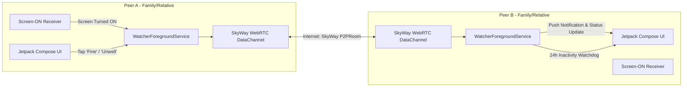

# BugsLife (遠隔見守り) - P2P Mutual Safety Watcher

[-green.svg)](https://developer.android.com)
[](https://kotlinlang.org)
[](https://skyway.ntt.com)
[](https://developer.android.com/jetpack/compose)
[](LICENSE)

[**日本語ドキュメント (Japanese)**](./README.ja.md)

**BugsLife** is a decentralized, peer-to-peer (P2P) safety monitoring Android application designed to keep distant family members, relatives, and friends connected and safe across the Internet (Wi-Fi and 4G/5G mobile networks) without centralized surveillance servers or account registrations.

It connects devices seamlessly via **NTT Communications SkyWay (WebRTC DataChannel)** simply by setting a shared group/room name.

It operates on a **Mutual Watching Model** where all connected devices act as both sender and watcher.

---

## 💡 Philosophy & Policy

### 🤝 Equal, Peer-to-Peer Mutual Watching
- **Eliminating "Watcher vs Watched" Hierarchies**: Unlike traditional surveillance-style monitoring apps that enforce an asymmetrical relationship (e.g., watcher vs. watched), BugsLife is designed on the principle of **equal peers caring for each other's safety and well-being**.
- **Minimizing Psychological Burden**: Removes the uncomfortable feeling of being constantly monitored, allowing loved ones to naturally stay informed of each other's safety through ordinary smartphone activity (e.g., turning on the screen).

---

## 🔒 Security & Privacy

1. **Robust Encrypted Protocol via SkyWay**:
   - Powered by NTT Communications SkyWay platform, utilizing battle-tested WebRTC encryption protocols (DTLS-SRTP / SCTP over DTLS) to protect against eavesdropping and data tampering.
2. **Minimal Data Transmission (User Status Only)**:
   - Data sent is strictly limited to non-intrusive personal status indicators (such as Screen-ON activity heartbeats or "Feeling Good / Not Well" signals).
   - No GPS locations, camera feeds, voice recordings, or device activity logs are ever accessed or transmitted.
3. **Completely Serverless & Zero Server-Side Storage (Direct P2P)**:
   - Operates entirely on direct P2P connections; no user data, messages, or activity histories are stored on central cloud servers.
   - Even in the unlikely event of external security incidents, personal safety records cannot be leaked as they simply do not exist on any server.

---

## 🌟 Key Features

1. **Internet P2P Communication (SkyWay WebRTC DataChannel)**:
   - Seamlessly connects across mobile data (4G/5G) and Wi-Fi networks using **NTT Communications SkyWay WebRTC DataChannel** with STUN/TURN NAT traversal.
   - Devices in the same Room automatically discover each other without manual IP entry.

2. **Automatic Screen-ON Heartbeat (P2P 1:n)**:
   - When you turn ON or unlock your smartphone screen (`ACTION_SCREEN_ON` / `ACTION_USER_PRESENT`), an automatic heartbeat signal is sent to all group members.
   - Built-in debounce mechanism (15 seconds) prevents unnecessary battery and network drain.

3. **24-Hour Inactivity Watchdog Alert**:
   - Continuously tracks the last-seen active timestamp of all connected peers.
   - If no screen-ON or heartbeat signal is received for **24 hours** (configurable from 1 min to 24 hours for testing), a high-priority alarm notification (sound, vibration, heads-up) is triggered.

4. **One-Tap Quick Status Buttons**:
   - Senior-friendly, large tactile buttons:
     - **😄 Feeling Good (元気です)**: Informs everyone that you are doing great.
     - **😣 Not Well (良くない)**: Promptly alerts all connected peers with high priority.

5. **Mutual Watching Unified Interface**:
   - Single unified screen: No complex role selection needed.
   - Displays the current SkyWay Room Name.
   - Real-time elapsed time counters (e.g. "15 minutes ago", "23 hours ago") for every peer.
   - Real-time communication logs inspection bottom sheet.

6. **Broad Device Compatibility**:
   - Supports **Android 6.0 (API 23, Marshmallow) up to Android 15+**.
   - Stable background operation via persistent Foreground Service.

---

## 🌐 About SkyWay & Getting API Keys

BugsLife uses **SkyWay**, an enterprise-grade WebRTC communication platform provided by NTT Communications, for secure end-to-end P2P DataChannel networking.

### Why SkyWay?
- Direct, encrypted peer-to-peer communication without storing private data on third-party servers.
- Automatic STUN/TURN NAT and firewall traversal across 4G/5G mobile carriers and home Wi-Fi networks.
- **Free tier available for developers and personal use.**

### How to Get Your SkyWay API Keys

1. Go to the [SkyWay Console](https://console.skyway.ntt.com/) and create a free account or log in.
2. In the dashboard menu, navigate to **"Applications"** and click **"Create Application"**.
3. Enter an application name (e.g., `BugsLife`) and submit.
4. From the application details page, copy the following two credentials:
   - **Application ID (App ID)**: `xxxxxxxx-xxxx-xxxx-xxxx-xxxxxxxxxxxx` (UUID format)
   - **Secret Key**: `xxxxxxxxxxxxxxxxxxxxxxxxxxxxxxxxxxxxxxxxxxx=` (Base64 string)
5. On all watching devices, open BugsLife, tap **Settings (⚙️)** in the top right corner, and enter the **App ID** and **Secret Key**.

> [!TIP]
> Ensure all family/group members configure the **same App ID, Secret Key, and Room Name** to automatically connect with each other.

---

## 🛠 Architecture & Tech Stack

- **UI**: Jetpack Compose (Material Design 3)
- **Language**: Kotlin + Coroutines / StateFlow
- **Service**: Android Foreground Service (`WatcherForegroundService`)
- **Networking**:
  - **SkyWay WebRTC**: `SkyWayPeerMessenger` (P2PRoom & DataStream)



---

## 🚀 Getting Started

### Prerequisites
- Android Studio Ladybug or newer / JDK 17+
- Android Device or Emulator running Android 6.0+ (API 23+)
- Internet connection (Wi-Fi or Mobile Data)
- SkyWay Account (Free) App ID and Secret Key

### Installation & Run

1. Clone this repository:
   ```bash
   git clone https://github.com/amekusa03/BugsLife.git
   cd BugsLife
   ```

2. Build and run debug APK:
   ```bash
   ./gradlew assembleDebug
   ```

3. Install on connected Android devices:
   ```bash
   adb install -r app/build/outputs/apk/debug/app-debug.apk
   ```

---

## 📖 How to Use

1. Launch **BugsLife** on two or more Android devices.
2. Open **Settings (⚙️)**:
   - Ensure **SkyWay Connection** is enabled.
   - Enter your **SkyWay App ID** and **Secret Key**.
   - Set the same **Room Name** (e.g. `tanaka-family-room`) on both devices.
3. Turn off and turn on the screen on Device A: Device B will automatically discover Device A and update the last-seen status and time over the Internet!
4. Tap **"😄 元気です"** or **"😣 良くない"** to send instant push notifications.

---

## 🗺 Development Status

- [x] **Persistent Watching Core System**
  - Screen-ON detection via BroadcastReceiver & Foreground Service
  - 24-hour inactivity watchdog & alarm notification alert
  - Senior-friendly large quick status buttons
  - Android 6.0 (API 23) to Android 15+ full compatibility
- [x] **Internet P2P Communication (SkyWay WebRTC)**
  - SkyWay SDK v2.9.0 integration (P2PRoom & DataStream)
  - Automatic Auth Token JWT generation
  - STUN/TURN NAT traversal across 4G/5G and separate Wi-Fi networks
  - Room name based automatic discovery & messaging
  - Real-time communication logs inspection sheet

---

## 📄 License

```text
Copyright 2026 amekusa03

Licensed under the Apache License, Version 2.0 (the "License");
you may not use this file except in compliance with the License.
You may obtain a copy of the License at

    http://www.apache.org/licenses/LICENSE-2.0
```
