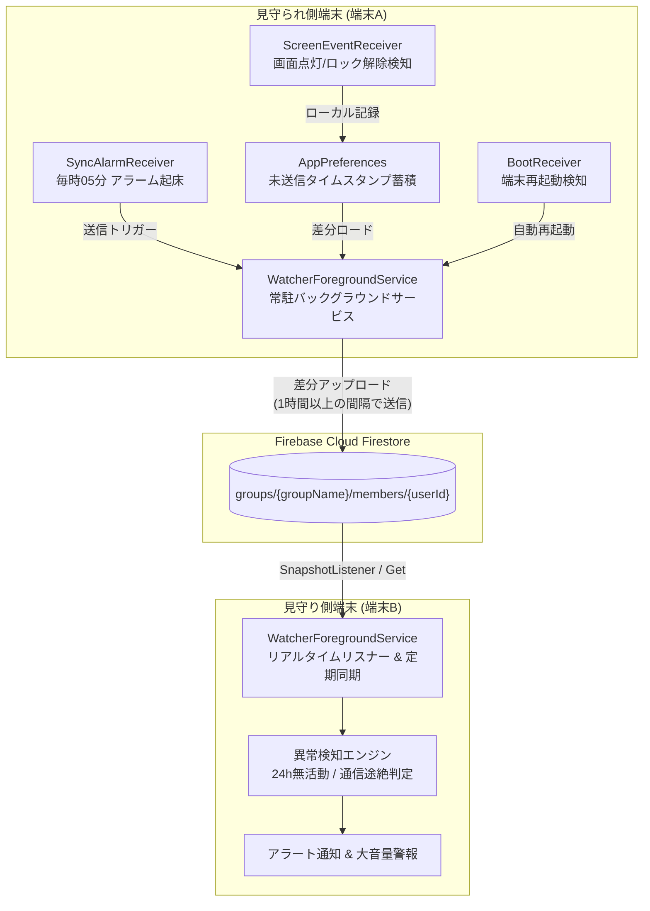
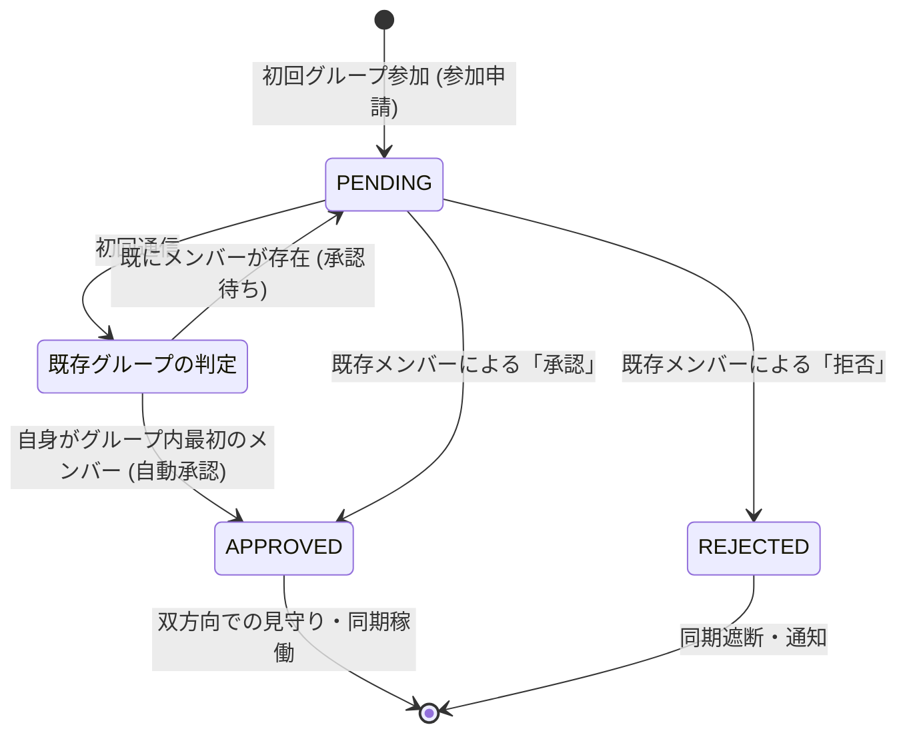

# BugsLife (バグズ・ライフ) - システム詳細仕様書

本書は、超低消費電力・遠隔安否見守りシステム「BugsLife」の全体アーキテクチャ、データモデル、状態遷移、バックグラウンド動作仕様、および異常検知アルゴリズムを網羅した詳細仕様書です。

---

## 1. システム全体アーキテクチャ

BugsLife は、クライアント（Android 端末）とバックエンド（Firebase Cloud Firestore）の間でストア＆フォワード型の非同期データ同期を行うことで、通信量とバッテリー消費を最小化しています。



---

## 2. Android クライアント内部仕様

### 2.1 コンポーネント構成

| コンポーネント | 種別 | 責務・動作概要 |
| :--- | :--- | :--- |
| **`WatcherForegroundService`** | Foreground Service | 常駐型バックグラウンドサービス。Firestore のリアルタイム監視、データ同期、定期的な安否チェック、異常検知アラートの発動を統括。 |
| **`SyncAlarmReceiver`** | BroadcastReceiver | `AlarmManager.setExactAndAllowWhileIdle` により、端末の Doze モード（ディープスリープ）を解除して毎時05分に起床し、同期と監視を実行。 |
| **`ScreenEventReceiver`** | Dynamic Receiver | `ACTION_USER_PRESENT`（ロック解除）および `ACTION_SCREEN_ON`（画面点灯）を動的検知。3秒のデバウンス処理を実施。 |
| **`BootReceiver`** | Static Receiver | `ACTION_BOOT_COMPLETED` および `ACTION_MY_PACKAGE_REPLACED` を受信。ユーザーがアプリを開かなくてもサービスを自動起動。 |
| **`AppPreferences`** | Local Storage | 設定値、相手ステータス、過去の通信ログ（48時間）、送信待ちタイムスタンプを管理。 |

### 2.2 省電力・軽量化（検量性）設計
1. **通信間隔の最小化**:
   - 画面ロック解除時であっても、前回の Firebase 正常送信から **1時間以上** 経過していなければ通信を行わず、ローカルバッファにタイムスタンプを溜める。
2. **タイムスタンプの重複間引き**:
   - 1分以内の連続したロック解除・画面点灯操作は、最新時刻に自動マージして配列の肥大化を防止。
3. **通信ログのローテーション**:
   - 48時間以上経過した通信ログは自動破棄。最大保持件数は100件に制限。

---

## 3. Firestore データモデル & スキーマ

Firestore のデータは、合言葉ごとにグループ分けされた `groups` コレクション配下に保存されます。

### 3.1 ドキュメントパス
`groups/{groupName}/members/{userId}`

### 3.2 データスキーマ詳細

```json
{
  "id": "String (UUID: 端末一意識別子)",
  "name": "String (ユーザー名)",
  "lastSeenTimestamp": "Number (最終更新・通信ミリ秒タイムスタンプ)",
  "lastStatus": "String (GOOD | NOT_GOOD | null)",
  "lastMessage": "String (ステータス補助メッセージ)",
  "isAlertTriggered": "Boolean (24時間無操作等のアラート発動フラグ)",
  "memberStatus": "String (APPROVED | PENDING | REJECTED)",
  "unlockTimestamps": [
    "Number (過去24時間のロック解除ミリ秒タイムスタンプ配列)"
  ]
}
```

### 3.3 タイムスタンプのマージ仕様
- 送信時、サーバーに既存の `unlockTimestamps` が存在する場合、クライアントの送信バッファとサーバー既存配列を合算（Set で重複排除）し、**過去24時間以内のデータのみを昇順で最大100件** にトリミングして更新。

---

## 4. 相互承認・グループ参加プロトコル

第三者による勝手な見守り登録や盗み見を防止するため、グループ参加には既存メンバーによる相互承認フローを採用しています。



- **新規グループ作成時**: 最初に参加したメンバーは自動的に `APPROVED`（承認済み）。
- **2人目以降の参加**: `PENDING`（承認待ち）状態で登録。相手画面に「承認」「拒否」ボタンが表示され、承認されるまで相手の活動データはマスク。

---

## 5. 異常検知 & アラート発動ロジック

本システムは、**「人の異常」** と **「端末の異常」** の2系統を独立して監視します。

```mermaid
flowchart TD
    Start[定期チェック実行 (毎時05分 / 受信時)] --> Q1{相手の memberStatus が<br/>APPROVED か？}
    Q1 -- No --> End[監視スキップ]
    Q1 -- Yes --> Q2{相手の unlockTimestamps が<br/>24時間以内に 0件 か？}
    
    Q2 -- Yes (0件) --> AlertHuman[🚨 人的異常アラート発動<br/>・24時間スマホ操作なし<br/>・大音量アラーム & バイブレーション<br/>・通知バーに緊急警告]
    Q2 -- No (1件以上あり) --> Q3{最終通信から<br/>制限時間(24h等)以上<br/>経過しているか？}
    
    Q3 -- Yes --> AlertDevice[⚠️ 通信途絶アラート発動<br/>・端末故障 / バッテリー切れ / 圏外<br/>・通知バーに警告]
    Q3 -- No --> Normal[🟢 正常稼働状態]
```

### 5.1 アラートの挙動
- **大音量アラーム**: マナーモードや消音設定をオーバーライドしてループ再生。
- **通知バー**: 緊急警告通知をピン留め表示。
- **UI表示**: 該当ユーザーのカードを赤枠・緊急警告バナーで強調表示。
- **復帰**: 相手がスマホを操作（ロック解除）または「元気です」を送信すると自動的に通常状態へ復旧。

---

## 6. セキュリティ・プライバシー方針
1. **位置情報・詳細ログの非保持**:
   - GPS位置情報や起動アプリ名などの機微情報は一切取得・送信せず、「スマホの画面がついた/解除された日時（ミリ秒）」のみを共有。
2. **ローカル完結の異常判定**:
   - サーバー側に常時監視ボットを置かず、各端末のローカルバックグラウンドサービスが自律的に相手の状態を判定。
